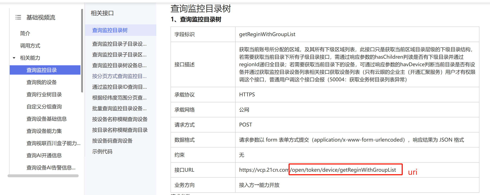
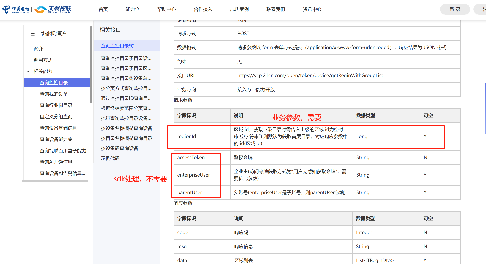
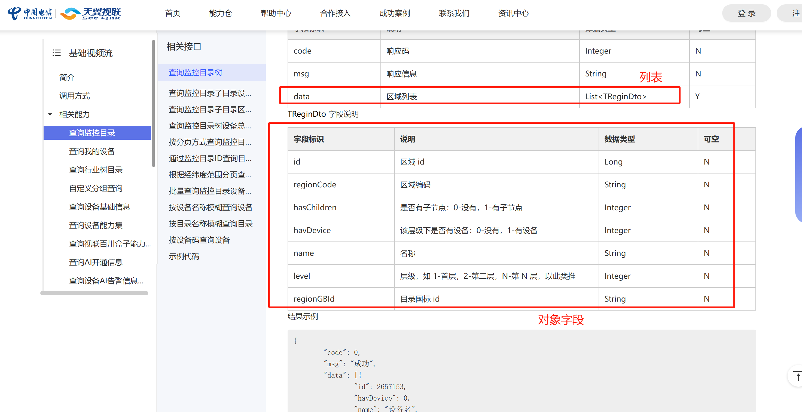

# 基于天翼视联API封装的sdk
## 简介
### 背景
本项目旨在简化天翼视联相关api调用接口。方便项目快速集成天翼视联调用能力。
使用过程中请参考官方文档查看接口细节：https://open.ctseelink.cn/portal/document-open/
### 功能
- 基于guava实现本地缓存token
- 调用方无需关心token凭证的获取和保存
- 支持检测调用结果码，自动抛出异常
- 支持返回结果自动转业务对象（支持简单对象/列表），调用方无需手动转json字符串
### 注意
目前只封装了通用调用接口的处理。具体用到哪个api需要参考接口文档：https://open.ctseelink.cn/portal/document-open/
## 使用方式
pom导入包，目前已上传maven中央仓库：
~~~
# pom.xml导入包
<dependencies>
    <dependency>
        <groupId>io.github.lb1565387341</groupId>
        <artifactId>yunyan-spring-boot-starter</artifactId>
        <version>0.0.2</version>
    </dependency>
</dependencies>
~~~
yaml文件增加配置
~~~
yun-yan:
  enabled: true # 启用组件
  app-id: # 平台配置-AppID（应用ID）
  app-secret: # 平台配置-AppSecret（应用请求密钥）
  rsa-private-key: # 平台配置-RSA私钥（rsa_private_key）
  enterprise-user: # 企业号。主账号手机号
~~~

以查询监控树举例：
- 1.找到uri
- 2.只需要传业务参数
- 3.创建返回对象BusinessPojo。字段名和文档一一对应，方便框架转换
代码：
~~~
@Resource
private YunYanApiClient yunYanApiClient; # 云眼api client

Map<String, Object> paramMap1 = Maps.newHashMap();
paramMap1.put(YunYanVariable.REGION_ID, "123"); # 参数key值为了统一，建议使用YunYanVariable类

# 返回对象是list
BusinessPojo1 response1 = yunYanApiClient.executeApi("/open/token/device/getReginWithGroupList", paramMap1, false,
    new TypeReference<List<BusinessPojo1>>() {
    }));
}
# 返回对象是单个对象
BusinessPojo2 response2 = yunYanApiClient.executeApi("xxxx", paramMap2, false,
    new TypeReference<BusinessPojo2>() {
    }));
}
# 第三个参数代表返回结果是否需要解密，一般不需要。特殊接口如获取监控视频文件的一些接口可能需要解密。
如果发现调用错误请查阅官方文档后自行调试尝试。
~~~
## 案例
待补充
## 常见问题
待补充
## 作者
电信小员工一枚。
### 联系方式
待补充
### wechat号
加微信请注明来意
